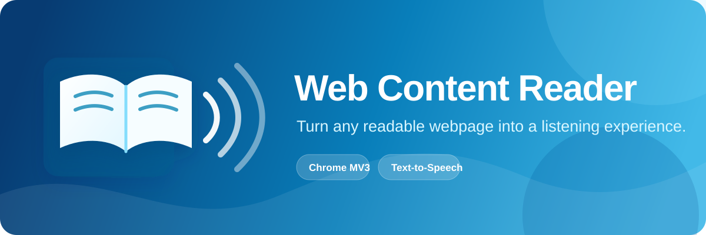

<p align="center">
  
</p>

<p align="center">
  A lightweight Chrome extension that reads webpage content aloud with clear playback controls, voice choices, and adjustable speed.
</p>

<p align="center">
  
  
  
  
</p>

## About

Web Content Reader makes long-form web content easier to consume. Open the extension on a webpage, choose what to read, and Chrome reads it through its built-in text-to-speech engine. It is designed for articles, documentation, blogs, study material, and any other text-heavy page.

The reader runs as a Manifest V3 extension and extracts text only when you press **Read**. Your reading preferences are stored in Chrome sync storage so they stay available between sessions.

## Features

| Feature | What it does |
| --- | --- |
| **Article mode** | Finds the main content area and skips common page clutter such as menus, sidebars, forms, and ads. |
| **Full-page mode** | Reads all visible text on the page. |
| **Selected-text mode** | Reads only the text you highlighted. |
| **Chrome text-to-speech** | Uses the extension-level Chrome TTS API for dependable playback. |
| **Voice selection** | Lists the voices that are available through Chrome on your device. |
| **Speed control** | Set the speaking rate from 0.5× to 2×. |
| **Playback controls** | Start, pause, resume, or stop reading at any time. |
| **Auto-scroll** | Keeps the current section visible while the reader progresses. |
| **Saved preferences** | Remembers your preferred mode, voice, speed, and auto-scroll setting. |
| **Helpful feedback** | Explains when a page cannot be read, text is missing, or Chrome blocks access to an internal page. |

## Technology

| Technology | Purpose |
| --- | --- |
| **Chrome Extensions Manifest V3** | Defines the extension, permissions, toolbar action, and service worker. |
| **Chrome TTS API** | Speaks extracted text and manages pause, resume, and stop actions. |
| **Chrome Scripting API** | Extracts text from the active page only after the user starts reading. |
| **Chrome Storage API** | Saves the reader settings using `chrome.storage.sync`. |
| **HTML, CSS, and Vanilla JavaScript** | Builds the popup interface and extension logic without third-party dependencies. |

## How to use

1. Open a regular webpage containing readable text.
2. Click the **Web Content Reader** extension icon.
3. Choose one of the reading modes:
   - **Article only** for the main article or document content.
   - **Full page** for all visible page text.
   - **Selected text** after highlighting text on the page.
4. Optionally choose a voice, set the speed, and enable or disable auto-scroll.
5. Click **▶ Read**. Use **Pause**, **Resume**, or **Stop** whenever needed.

> Chrome does not allow extensions to read protected pages such as `chrome://` pages, the Chrome Web Store, or some browser PDF viewers. Use a normal website for reading.

## Project structure

```text
Web-Content-Reader-Extension/
├── assets/
│   └── readme-banner.svg  # Project banner displayed above
├── manifest.json          # Manifest V3 configuration and permissions
├── background.js          # Service worker: text extraction and Chrome TTS playback
├── popup.html             # Reader popup markup
├── popup.css              # Reader popup styling
├── popup.js               # Popup controls, settings, voice list, and status feedback
├── content.js             # Legacy helper retained for reference (not injected)
└── icon*.png              # Extension icons
```

## Permissions

The extension requests only the permissions needed to read the active webpage and remember your settings:

- `activeTab` — lets the extension work with the tab you explicitly use it on.
- `scripting` — extracts readable text and performs optional auto-scroll after you press **Read**.
- `tts` — enables Chrome's text-to-speech playback.
- `storage` — saves your reader preferences.

## License

This project is available under the [MIT License](https://opensource.org/licenses/MIT).
